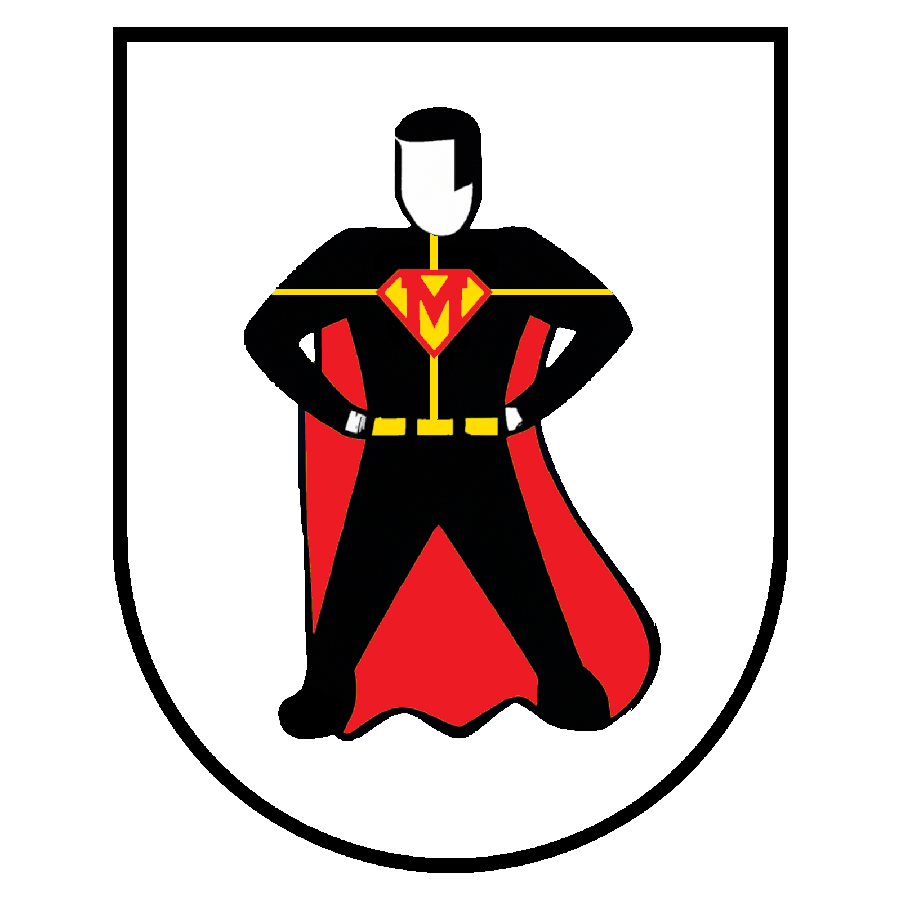

# MunichCityHero
Smart urban planning through geo-based user feedback.

- Find out where people in Munich need additional public water fountains
- Quick validation of infrastructure proposals
- Data-driven support for public decision-makers 

## Usage
- change API-key in `AndroidManifest.xml`
  ```cmd
  <application
    ...
      <meta-data android:name="com.google.android.geo.API_KEY"
                android:value="YOUR_API_KEY">
      </meta-data>
    ...
  ```
  
## Team
- Ulf Kasolowsky
- Maresa Fees
- Stefanie Albers
- Colin Moldenhauer

## Visuals


